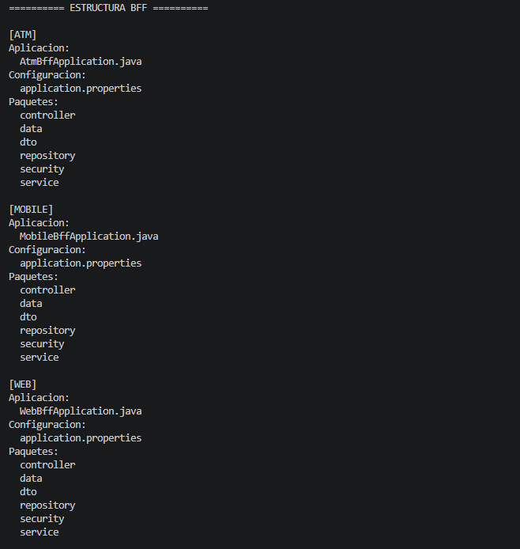
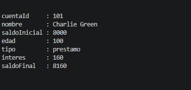
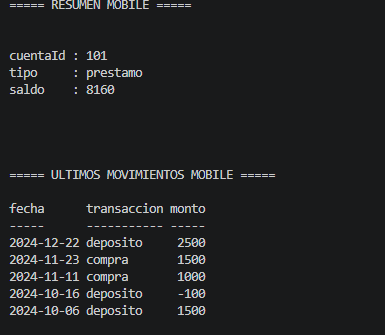
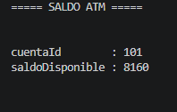
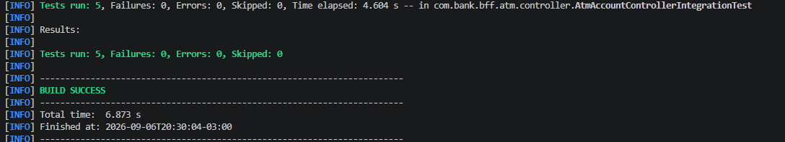
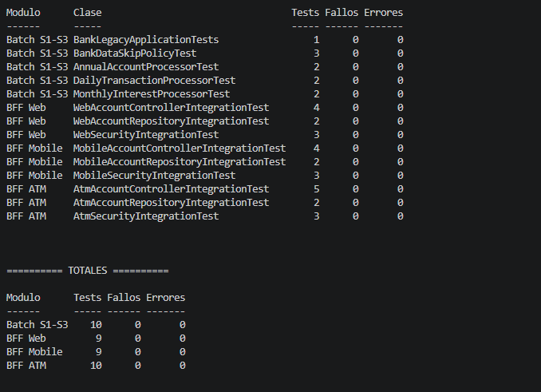

# Evidencias - Semana 4

## Backend for Frontend

Las evidencias de esta semana muestran la implementación del patrón Backend for Frontend (BFF) para los tres tipos de cliente solicitados: Web, Mobile y ATM.

### 01 - Estructura de los BFF

Se observan tres aplicaciones Spring Boot independientes: Web, Mobile y ATM. Cada una posee sus propias capas de controller, service, repository, DTO, data y security.

### 02 - BFF Web

El BFF Web entrega el detalle completo de la cuenta. La respuesta incluye siete campos, entre ellos nombre, saldo inicial, edad, tipo, interés y saldo final.

### 03 - BFF Mobile

El BFF Mobile entrega un resumen reducido de la cuenta y limita el historial a los últimos cinco movimientos, disminuyendo la cantidad de información enviada al cliente móvil.

### 04 - BFF ATM - Consulta de saldo

El BFF ATM expone una respuesta mínima para la consulta de saldo, con únicamente el identificador de la cuenta y el saldo disponible.

### 05 - BFF ATM - Retiro

Las cinco pruebas de integración del controlador ATM validan el flujo de consulta y retiro, incluyendo los casos de error. Todas finalizan correctamente.

### 06 - Validación global

La validación final ejecuta las pruebas del proyecto Batch original y de los tres BFF.

Resultados:

| Módulo | Tests | Fallos | Errores |
|---|---:|---:|---:|
| Batch S1-S3 | 10 | 0 | 0 |
| BFF Web | 9 | 0 | 0 |
| BFF Mobile | 9 | 0 | 0 |
| BFF ATM | 10 | 0 | 0 |
| **Total** | **38** | **0** | **0** |

También se validan de manera independiente `WebSecurityIntegrationTest`, `MobileSecurityIntegrationTest` y `AtmSecurityIntegrationTest`.