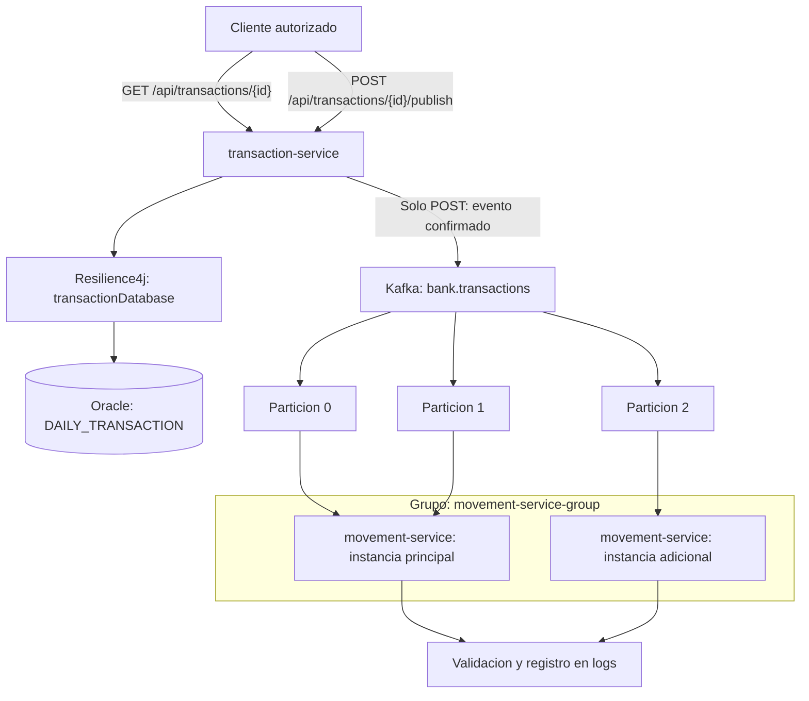

# Semana 7 - Arquitectura de eventos y tolerancia a fallos

## 1. Arquitectura implementada

Se utiliza Apache Kafka con el patron Publish/Subscribe para incorporar comunicacion asincrona entre microservicios, manteniendo las funcionalidades bancarias existentes.

- Productor: transaction-service.
- Consumidor: movement-service.
- Topico: `bank.transactions`.
- Particiones: 3.
- Grupo consumidor: `movement-service-group`.
- Infraestructura: Kafka mediante Docker Compose.
- Configuracion centralizada: Config Server.
- Descubrimiento de servicios: Eureka.

Kafka desacopla la publicacion del procesamiento y permite distribuir las particiones entre distintas instancias del consumidor.

## 2. Evento y publicacion

El evento `TransactionSnapshotPublished` representa los datos de una transaccion existente en `DAILY_TRANSACTION`.

Contiene exclusivamente:

| Campo | Descripcion |
|---|---|
| `id` | Identificador de la transaccion. |
| `fecha` | Fecha registrada. |
| `monto` | Importe de la transaccion. |
| `tipo` | Tipo de transaccion. |

La clave Kafka corresponde al identificador de la transaccion. Los eventos con la misma clave se envian a la misma particion, conservando su orden dentro de ella.

La consulta `GET /api/transactions/{id}` mantiene su comportamiento de solo lectura y no publica eventos.

La publicacion se realiza mediante la operacion explicita y autenticada `POST /api/transactions/{id}/publish`. El productor recupera los datos existentes y espera la confirmacion de Kafka antes de devolver HTTP 202.

## 3. Diagrama de arquitectura



El reparto 2+1 mostrado corresponde a la prueba realizada con dos instancias. La asignacion es dinamica: al cerrar la instancia adicional, Kafka redistribuye las particiones al consumidor restante.

## 4. Procesamiento asincrono y alcance

`movement-service` recibe el evento mediante `@KafkaListener`, valida su contenido y registra la transaccion, particion y offset procesados.

Este consumidor no modifica las tablas financieras de Oracle, no crea movimientos bancarios ni cambia saldos. El retiro ATM y las operaciones bancarias existentes conservan su implementacion anterior.

No se establece una relacion adicional entre transacciones y cuentas que no este presente en los datos originales.

## 5. Tolerancia a fallos

Se mantienen los Circuit Breakers Resilience4j existentes:

| Servicio | Circuit Breaker | Consulta protegida |
|---|---|---|
| transaction-service | `transactionDatabase` | Consulta de transacciones en Oracle. |
| movement-service | `movementDatabase` | Consulta de movimientos en Oracle. |

Configuracion de ambos: ventana de 4 llamadas, minimo de 2, umbral de fallos del 50 %, espera de 10 segundos en estado abierto y 1 llamada permitida en HALF_OPEN.

El fallback de las consultas devuelve HTTP 503 cuando la dependencia no esta disponible. No se presenta un error de base de datos como una transaccion inexistente.

## 6. Pruebas realizadas

### 6.1. Publicacion y consumo real

Se consulto exitosamente la transaccion existente ID 1 desde Oracle.

La operacion autenticada `POST /api/transactions/1/publish` respondio HTTP 202.

El consumidor confirmo:

```text
Evento procesado: transaccion=1, particion=0, offset=0
```

Resultado: comunicacion Oracle -> productor -> Kafka -> consumidor comprobada.

### 6.2. Escalabilidad horizontal

Se inicio una segunda instancia de `movement-service` en el puerto 8193, dentro del mismo grupo Kafka que la instancia principal del puerto 8093.

Kafka distribuyo las particiones de la siguiente manera:

| Instancia | Particiones asignadas | Eventos de prueba procesados |
|---|---|---:|
| Principal | 0 y 1 | 11 |
| Adicional | 2 | 1 |
| Total | 3 | 12 |

Los 12 eventos utilizados fueron sinteticos y se enviaron directamente al topico para demostrar el reparto entre consumidores. No realizaron operaciones financieras.

Esta prueba demuestra distribucion de particiones y procesamiento concurrente; no presupone que Kafka reparta una cantidad identica de mensajes por instancia.

### 6.3. Circuit Breaker ante indisponibilidad de Oracle

Se inicio una instancia aislada de `transaction-service` en el puerto 8192 con una conexion de base de datos deliberadamente inaccesible, sin modificar la configuracion de la instancia principal.

| Consulta | HTTP | Duracion |
|---|---:|---:|
| 1 | 503 | 2559 ms |
| 2 | 503 | 2511 ms |
| 3 | 503 | 4 ms |
| 4 | 503 | 3 ms |

Los registros de Resilience4j confirmaron:

```text
FAILURE_RATE_EXCEEDED: 100.0
STATE_TRANSITION: CLOSED to OPEN
NOT_PERMITTED
NOT_PERMITTED
```

Tras dos fallos, el circuito se abrio y las siguientes consultas fueron rechazadas sin repetir la espera de conexion.

La instancia principal, en el puerto 8092, continuo consultando correctamente la transaccion ID 1.

La prueba verifico la apertura del circuito; no se realizo una prueba independiente de recuperacion HALF_OPEN.

### 6.4. Pruebas automatizadas

Se ejecutaron las pruebas unitarias del publicador y del consumidor sin fallos.

El empaquetado posterior de `transaction-service` tambien finalizo con BUILD SUCCESS y una prueba aprobada.

## 7. Estado final y limites

Las instancias adicionales utilizadas en las pruebas se detuvieron, conservando los servicios principales.

La integracion Kafka no reemplaza las operaciones transaccionales del sistema. Su funcion en esta actividad es publicar y consumir eventos existentes de forma desacoplada.

No se implementaron modificaciones de saldos, persistencia de eventos consumidos en Oracle ni un mecanismo adicional de reintentos/DLQ. Estas capacidades no forman parte de la implementacion demostrada.
## 8. Evidencias de ejecucion

Los archivos siguientes conservan fragmentos de los registros reales de las pruebas:

- [Publicacion y consumo](01-publicacion-consumo.txt).
- [Escalabilidad Kafka](02-escalabilidad.txt).
- [Circuit Breaker Resilience4j](03-circuit-breaker.txt).

Los registros completos originales se generaron durante las ejecuciones locales. Los archivos incluidos contienen los fragmentos necesarios para acreditar los resultados descritos.